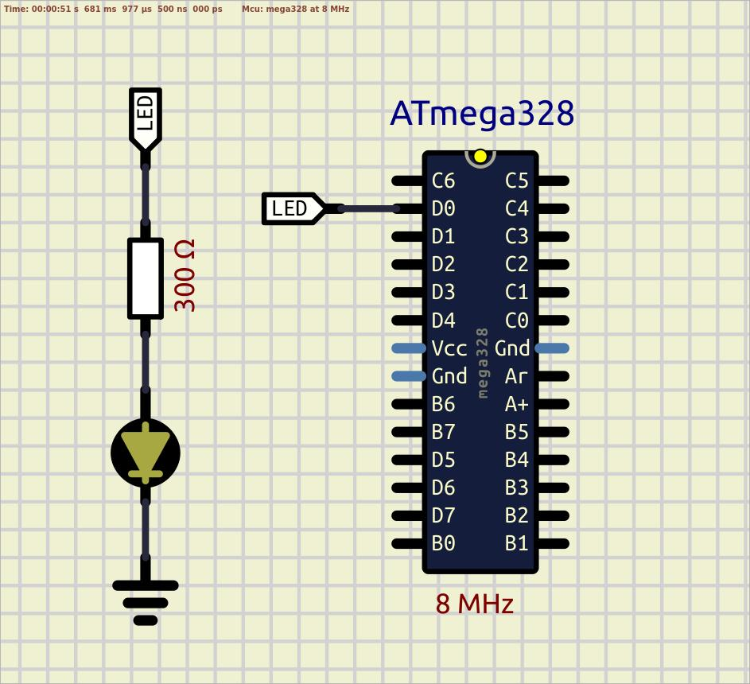

# Bare metal "Hello World"  

Here is a simpliest bare metal "Hello World" example without standard AVR libraries. It is important to keep in safe port's pins, so controlling some electrical parameters is crutual, especially the value of the current. DDRD and PORTD addresses are specified in the datasheet. Use the commands below to build the project and play with it.  

First of all, check that AVR toolchain and downloader-uploader are installed on your local machine, or install them with the command below, and restart the system:  
 `sudo apt install gcc-avr avr-libc avrdude`  

The initial command allows, in one shot, to preprocess, compile, assemble, and link the artifact from the 'main.c' source file:  
 `avr-gcc -mmcu=atmega328p -O0 -Wall -o main.elf main.c`  
With the flags applied, we specify the device name, disable compiler optimization, and show all compilation warnings if any occur.  

In order to display the sizes of sections inside binary files:  
 `avr-size --format=avr --mcu=atmega328p main.elf`  
Two flags applied display info in AVR specific manner with calculation of a free memory space.  

The previously generated binary file is executable, but it is not ready for upload. In fact, this format is incompatible with the Intel Hex format, which is basically just plain text containing the binary data encoded in its textual representation. `objcopy` is capable of extracting the binary information in one format and translating it to another.  
 `avr-objcopy --input-target elf32-avr --output-target ihex --verbose main.elf firmware.hex`  

In order to view assembly listing use the next command:  
 `avr-objdump --disassemble main.elf`  

To check connection with the AVR controller:  
 `avrdude -c usbasp-clone -p atmega328p`  

To upload the firmware to the flash memory:  
 `avrdude -c usbasp-clone -p atmega328p -U flash:w:./firmware.hex:i`  

To erease the chip:  
 `avrdude -c usbasp-clone -p atmega328p -e`  

To remove all build artifacts use:  
 `rm *.hex *.elf`  

 

For extra investigation:  
- compile 'main.c' source file with regular GNU gcc compiler, and then compare file types of 'a.out' and 'main.elf' using `file` command;  
- review an assembly listing of a source code.   

See also:  
- [ATmega328P Datasheet](https://ww1.microchip.com/downloads/en/DeviceDoc/Atmel-7810-Automotive-Microcontrollers-ATmega328P_Datasheet.pdf)  
- [Section 13 "I/O-Ports"](https://ww1.microchip.com/downloads/en/DeviceDoc/Atmel-7810-Automotive-Microcontrollers-ATmega328P_Datasheet.pdf#G1182902)  
- [Section 28.1 "Electrical Characteristics - Absolute Maximum Ratings"](https://ww1.microchip.com/downloads/en/DeviceDoc/Atmel-7810-Automotive-Microcontrollers-ATmega328P_Datasheet.pdf#G1411831)  
- [Section 30 "Register Summary"](https://ww1.microchip.com/downloads/en/DeviceDoc/Atmel-7810-Automotive-Microcontrollers-ATmega328P_Datasheet.pdf#G1446876)  
- [AVRDUDE - AVR Downloader/Uploader](https://www.nongnu.org/avrdude/)  

