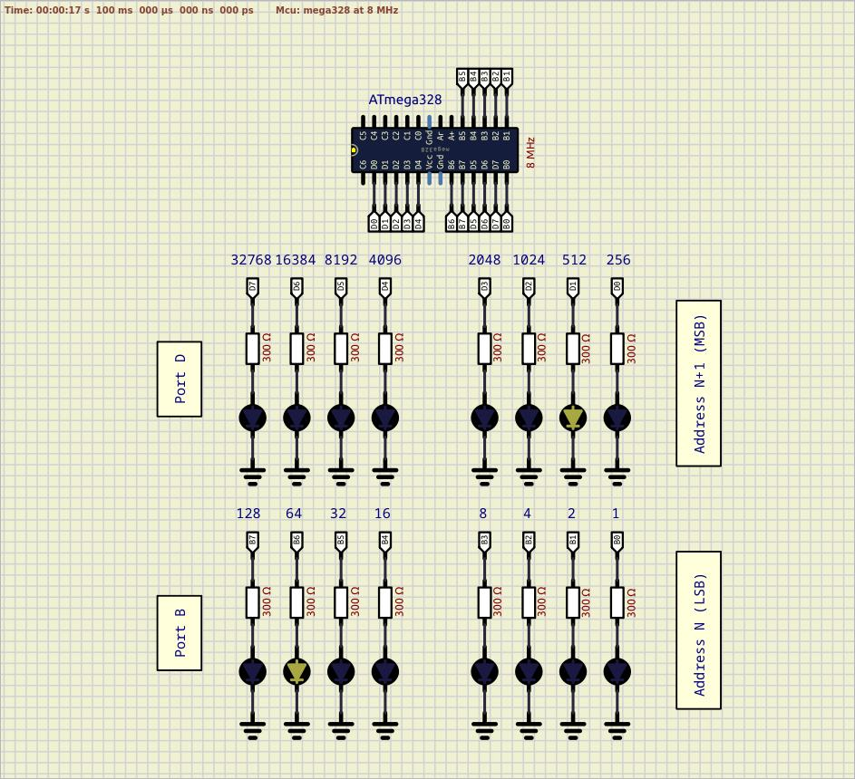

# Endianess

Endianess: Little  

This means that complex data types with more than 1 byte size stores in memory as a sequence: from LSB to MSB.
Current solution introduces example with two bytes value 576 which has binary representation as [0000 0010] [0100 0000] or (512 + 64).
Where the Most Significant Byte (MSB) will be [0000 0010] and the Least Significant Byte (LSB) will be [0100 0000].  

In this example the 'Makefile' adjusted with the next targets: 'disasm', 'size'. Initial compiler optimization specifies as '-Os' (optimize for space rather than speed). 
Take a look at the assembly listing and the firmware size with:  
`make && make disasm && make size`  

For extra investigation:  
- change the optimization flag to '-O0' (no optimization), and repeat previous command;  
- change the optimization flag to '-Os, add 'static inline' keywords before 'void \_init\_io\_pins(void)', and do the disasm and size again.  

All previously generated assebly listings contain some common code parts such as:  
- `<__vectors>` - interrupt vector table;   
- `<__ctors_end>` - initialization sequence;    
- `<__bad_interrupt>` - pointer for missing ISR;  
- `<main>` - main function;  
- `<_exit>` - disable global interrupts;  
- `<__stop_program>` - stop MCU with infinite loop.  

Review the <\_\_ctors\_end> part that contains next code:  
```assembly
  68:	11 24       	eor	r1, r1  
  6a:	1f be       	out	0x3f, r1	; 63  
  6c:	cf ef       	ldi	r28, 0xFF	; 255  
  6e:	d8 e0       	ldi	r29, 0x08	; 8  
  70:	de bf       	out	0x3e, r29	; 62  
  72:	cd bf       	out	0x3d, r28	; 61  
  74:	0e 94 40 00 	call	0x80	; 0x80 <main>  
  78:	0c 94 51 00 	jmp	0xa2	; 0xa2 <_exit>  
```
Breaking it down:  
```assembly
  eor   r1, r1  
  out   0x3f, r1  
```
Register 0x3f is SREG - the status register, which contains status bits like N, Z, and C, as well as the interrupt enable bit. This code clears the register. The register should already be cleared at reset, but a bootloader or a partial software reset may have left it in an inconsistent state.  
```assembly
  ldi   r28, 0xFF  
  ldi   r29, 0x08  
  out   0x3e, r29  
  out   0x3d, r28  
```
Ports 0x3d and 0x3e are the high and low portions of the stack pointer. This code initializes the stack pointer to 0x08FF, at the top of RAM. This is, again, identical to the reset state of the processor, so this is more of a precaution than a necessity.  
```assembly
  call  main  
  jmp   _exit  
```
This calls your main function, then jumps to \_exit (an infinite loop) in case main returns.  

  

See also:  
- [GCC Wiki avr-gcc](https://gcc.gnu.org/wiki/avr-gcc#Type_Layout "Type Layout")
- [AVR-GCC initialization code](https://electronics.stackexchange.com/questions/383026/avr-gcc-initialization-code "AVR-GCC initialization code")  
- [Endianess](https://en.wikipedia.org/wiki/Endianness "Endianess")  
- [AVR Instruction Set Manual](https://ww1.microchip.com/downloads/en/devicedoc/atmel-0856-avr-instruction-set-manual.pdf "AVR Instruction Set Manual")  
- [Inline function in C](https://www.geeksforgeeks.org/inline-function-in-c/ "Inline function in C")  

