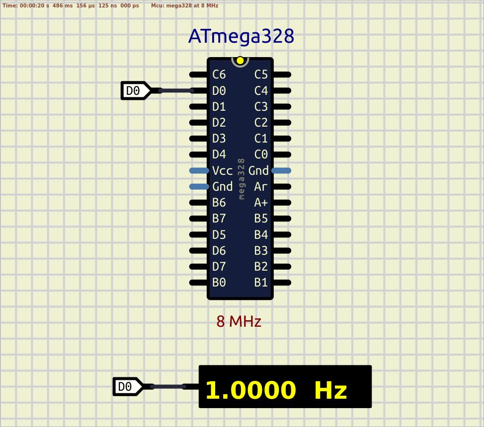

# Fuses, delay

Working mode of AVR microcontrollers is configured with so called 'Fuse Bits'.  

The device is shipped with the internal RC oscillator at 8.0MHz and with the fuse CKDIV8 programmed, resulting in 1.0MHz system clock. Let's adjust our 'Makefile' with two more targets 'fuses-default', which resets fuse bits to the initial state, and 'fuses-no-divider-int-rc', which keeps internal RC Oscillator as a source of pulses, but disables clock divider bit, and MCU will be configured for the 8MHz frequency.

There are two approaches to work with time intervals in microcontrollers: software and hardware.  
Software approach based on the dummy moving of an instruction pointer in loops (to form delays), hardware approach instead uses built-in hardware timer-counters.  

First of all disable internal clock divider with:  
`make fuses-no-divider-int-rc`  

Then, check the REAL frequencies on the pin 0 of port D using oscilloscope and write down the actual results. Here is some values of measurement:  
|**Expected frequency**  |**Actual frequency**    |
|:---------------------|:--------------|
|1Hz    |1.0Hz   |
|24Hz   |24.0-24.1Hz   |
|50Hz   |50.1-50.2Hz   |
|240Hz  |241Hz   |
|50kHz  |47.2-47.3kHz|

You have to see that some values are not very precise, especially when generating 50kHz signal. After testing the 50kHz take a look at the assembler listing, in particularly `<main>` section.  

```assembler
00000080 <main>:
  80:   50 9a           sbi     0x0a, 0 ; 10

  82:   91 e0           ldi     r25, 0x01       ; 1
  84:   8b b1           in      r24, 0x0b       ; 11
  86:   89 27           eor     r24, r25
  88:   8b b9           out     0x0b, r24       ; 11

  8a:   8a e1           ldi     r24, 0x1A       ; 26
  8c:   8a 95           dec     r24
  8e:   f1 f7           brne    .-4             ; 0x8c <main+0xc>
  90:   00 c0           rjmp    .+0             ; 0x92 <main+0x12>
  92:   f8 cf           rjmp    .-16            ; 0x84 <main+0x4>
```
Here we can highlight three parts of a programm:  
instruction [80] - setting DDRD (pin 0) as output;  
instructions [82 ; 88] - toggling PORTD (pin 0);  
instructions [8a ; 92] - delay itself with while loop jump.  

Delay "cost" calculation:  
`ldi` - runs as 1 cycle, 1 time  
`dec` - runs as 1 cycle, 26 times  
`brne` - runs as 2 cycles instruction 24 times, and as 1 cycle instruction 1 time  
`rjmp` - runs as 2 cycles instruction, 2 times  

Total: (1x1) + (1x26) + (2x24) + (1x1) + (2x2) = 80 "burned" cycles  

  

See also:  
- [9.2.1 Default Clock Source](https://ww1.microchip.com/downloads/en/DeviceDoc/ATmega48A-PA-88A-PA-168A-PA-328-P-DS-DS40002061B.pdf#G3.1305082 "Default clock source")  
- [28.2 Fuse Bits](https://ww1.microchip.com/downloads/en/DeviceDoc/ATmega48A-PA-88A-PA-168A-PA-328-P-DS-DS40002061B.pdf#G3.1742043 "Fuse Bits")  
- [36. Register Summary](https://ww1.microchip.com/downloads/en/DeviceDoc/ATmega48A-PA-88A-PA-168A-PA-328-P-DS-DS40002061B.pdf#G3.2063043 "36. Register Summary")  
- [SBI – Set Bit in I/O Register](https://ww1.microchip.com/downloads/en/devicedoc/atmel-0856-avr-instruction-set-manual.pdf#_OPENTOPIC_TOC_PROCESSING_d94e30064 "SBI – Set Bit in I/O Register")  
- [LDI - Load Immediate](https://ww1.microchip.com/downloads/en/devicedoc/atmel-0856-avr-instruction-set-manual.pdf#_OPENTOPIC_TOC_PROCESSING_d94e24158 "LDI - Load Immediate")  
- [IN - Load an I/O Location to Register](https://ww1.microchip.com/downloads/en/devicedoc/atmel-0856-avr-instruction-set-manual.pdf#_OPENTOPIC_TOC_PROCESSING_d94e21922 "IN - Load an I/O Location to Register")  
- [EOR - Exclusive OR](https://ww1.microchip.com/downloads/en/devicedoc/atmel-0856-avr-instruction-set-manual.pdf#_OPENTOPIC_TOC_PROCESSING_d94e20363 "EOR - Exclusive OR")  
- [OUT – Store Register to I/O Location](https://ww1.microchip.com/downloads/en/devicedoc/atmel-0856-avr-instruction-set-manual.pdf#_OPENTOPIC_TOC_PROCESSING_d94e27587 "OUT – Store Register to I/O Location")  
- [LDI - Load Immediate](https://ww1.microchip.com/downloads/en/devicedoc/atmel-0856-avr-instruction-set-manual.pdf#_OPENTOPIC_TOC_PROCESSING_d94e24158 "LDI - Load Immediate")  
- [DEC - Decrement](https://ww1.microchip.com/downloads/en/devicedoc/atmel-0856-avr-instruction-set-manual.pdf#_OPENTOPIC_TOC_PROCESSING_d94e19336 "DEC - Decrement")  
- [BRNE - Branch if Not Equal](https://ww1.microchip.com/downloads/en/devicedoc/atmel-0856-avr-instruction-set-manual.pdf#_OPENTOPIC_TOC_PROCESSING_d94e14272 "BRNE - Branch if Not Equal")  
- [RJMP - Relative Jump](https://ww1.microchip.com/downloads/en/devicedoc/atmel-0856-avr-instruction-set-manual.pdf#_OPENTOPIC_TOC_PROCESSING_d94e28815 "RJMP - Relative Jump")  
- [AVR Fuse Calculator](https://www.engbedded.com/fusecalc/)  
