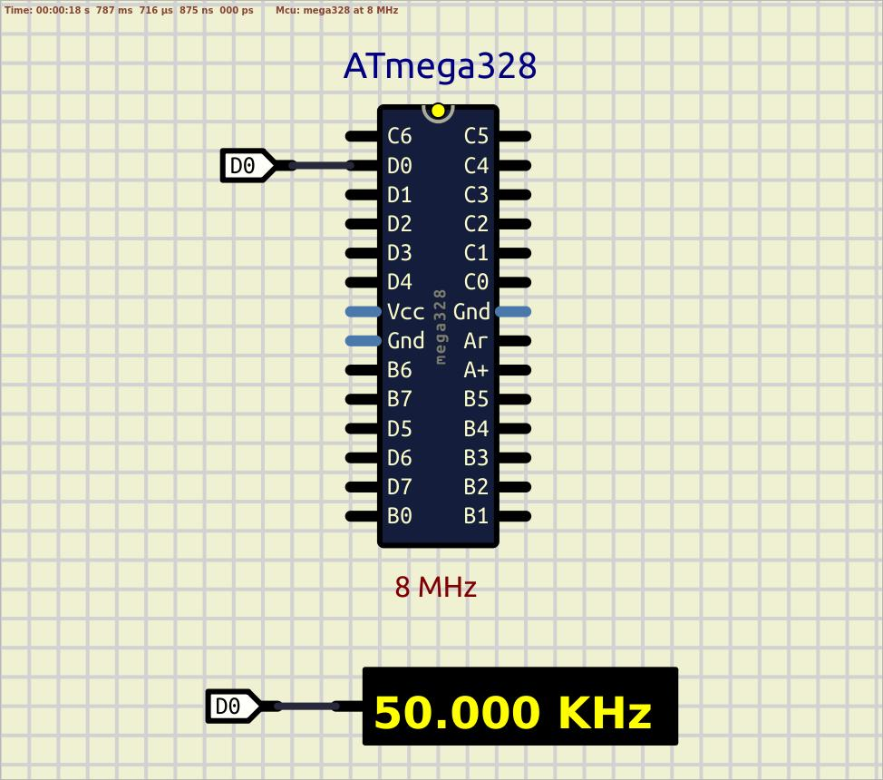

# Timer 0

To get most precise timings it is crutual to use hardwart internal timers/counters. For the current example Timer 0 will fit.  

Some registers description:  
TCCR0A – Timer/Counter Control Register channel A;  
TCCR0B – Timer/Counter Control Register channel B;  
TCNT0 – Timer/Counter Register (8-bit counter itself);  
OCR0A – Output Compare Register channel A;  
TIMSK 0 – Timer/Counter Interrupt Mask Register.  

With the current example you will get something that really similar to the 50kHz pulses, but depending on temperature or supply voltage result value may vary. 
Just for investigation try to freez the MCU, then check the real frequency on pin 0 port D, and then heat it, and check the frequency again. Moreover, try to change the value of supply voltage (of course do not exceed the maximum voltage, see the datasheet).  

Here is some results:  
- t = 28-29 degree Celsius: f = [50.1 ; 50.3] kHz;
- t = -3 degree Celsius: f = 49.6 kHz;
- t = 90-92 degree Celsius: f = [50.8 ; 50.9] kHz;
- V = 1.9 volts: f = 47.9 kHz;
- V = 2.5 volts: f = 49.5 kHz;
- V = 3.0 volts: f = 50.0 kHz;
- V = 4.0 volts: f = 50.1 kHz;
- V = 5.0 volts: f = 50.2 kHz;
- V = 5.5 volts: f = 50.2 kHz.

These results show that internal RC can't provide accurate timings. Let's adjust our 'Makefile' with the target `fuses-no-divider-ext-clk` which turn off internal prescaler and internal RC, and for now the MCU will look at the external oscillator, so just connect 8MHz crystal with two capacitors as described in the datasheet.  

Do the previous experiments again with external crystal. Now it looks really better:)  

  

For extra investigation:
- with 8MHz crystal make the fuse CKDIV8 programmed again (to get 1MHz result frequency) or use another 1MHz crystal, and try to generate 50kHz pulses again:);
- calculate the time for ISR (for this purpose disassemble the code and use AVR instruction set manual);
- measure consuming current with internal RC oscillator and external quartz crystal.

See also:  
- [15. 8-bit Timer/Counter0 with PWM](https://ww1.microchip.com/downloads/en/DeviceDoc/ATmega48A-PA-88A-PA-168A-PA-328-P-DS-DS40002061B.pdf#G3.1188731 "8-bit Timer/Counter0 with PWM")  
- [6.7.1 Interrupt Response Time](https://ww1.microchip.com/downloads/en/DeviceDoc/Atmel-7810-Automotive-Microcontrollers-ATmega328P_Datasheet.pdf#G1177521 "Interrupt Response Time")
- [9.2 Clock Sources](https://ww1.microchip.com/downloads/en/DeviceDoc/ATmega48A-PA-88A-PA-168A-PA-328-P-DS-DS40002061B.pdf#G3.1181917 "Clock Sources")  
- [9.3 Low Power Crystal Oscillator](https://ww1.microchip.com/downloads/en/DeviceDoc/ATmega48A-PA-88A-PA-168A-PA-328-P-DS-DS40002061B.pdf#G3.1306156 "Low Power Crystal Oscillator")  
- [9.4 Full Swing Crystal Oscillator](https://ww1.microchip.com/downloads/en/DeviceDoc/ATmega48A-PA-88A-PA-168A-PA-328-P-DS-DS40002061B.pdf#G3.1272090 "Full Swing Crystal Oscillator")  
- [9.6 Calibrated Internal RC Oscillator](https://ww1.microchip.com/downloads/en/DeviceDoc/ATmega48A-PA-88A-PA-168A-PA-328-P-DS-DS40002061B.pdf#G3.1182281 "Calibrated Internal RC Oscillator")  