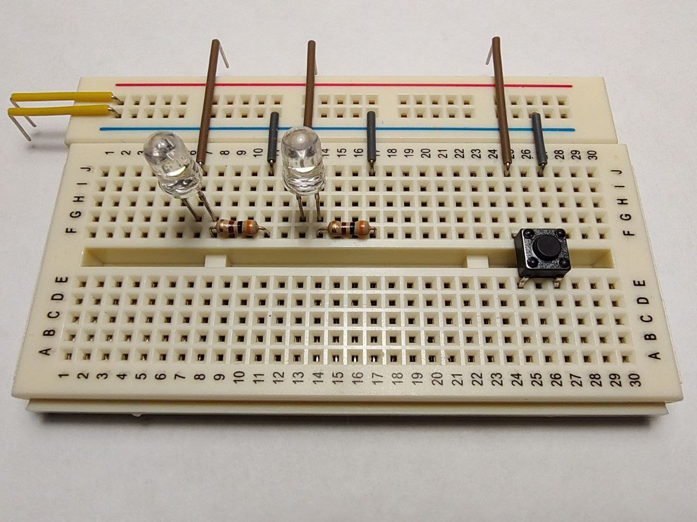

### Example 01 - INTERNAL PULL-UP resistor is used  

Scheme:  
  

Breadboard:  
  

**SIMULATION:** No simulation issues in SimulIDE  
**REALTIME:** The start is fine, several hits on the button are accompanied by a bounce  