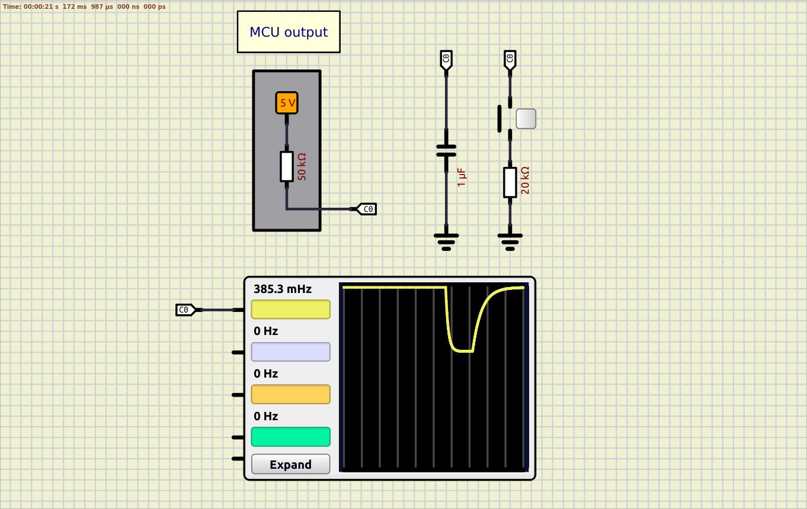

### Example 02 - INTERNAL PULL-UP resistor is used; R = 20kΩ and C = 1µF is used for debouncing  
Scheme:  
  

Equivalent circuit scheme:  

Breadboard:  
  

**SIMULATION:** LEDs is turned on at the beginning of a simulation in SimulIDE  
**REALTIME:** The start is incorrect: LEDs are turned on at the beggining. RC circuit for debounce is fine  

FIX: the internal pull-up resistor is placed before capacitor, it needs some time to become fully charged, so after internal pull-up resistor activation some delay is needed.  