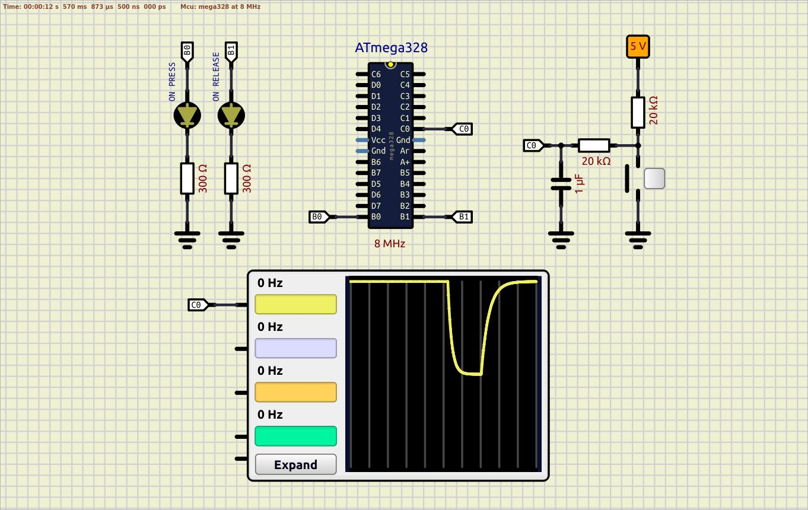

#### Example 04 - EXTERNAL PULL-UP resistor is used, R = 20kΩ; R = 20kΩ and C = 1µF is used for debouncing  

Scheme:  
  

Breadboard:  
  

**SIMULATION:** No simulation issues in SimulIDE  
**REALTIME:** The start is fine. RC circuit for debounce is fine, ignoring the pull-up resistor leads to the high-impedance state of a button pin, and LEDs start to blink randomly  