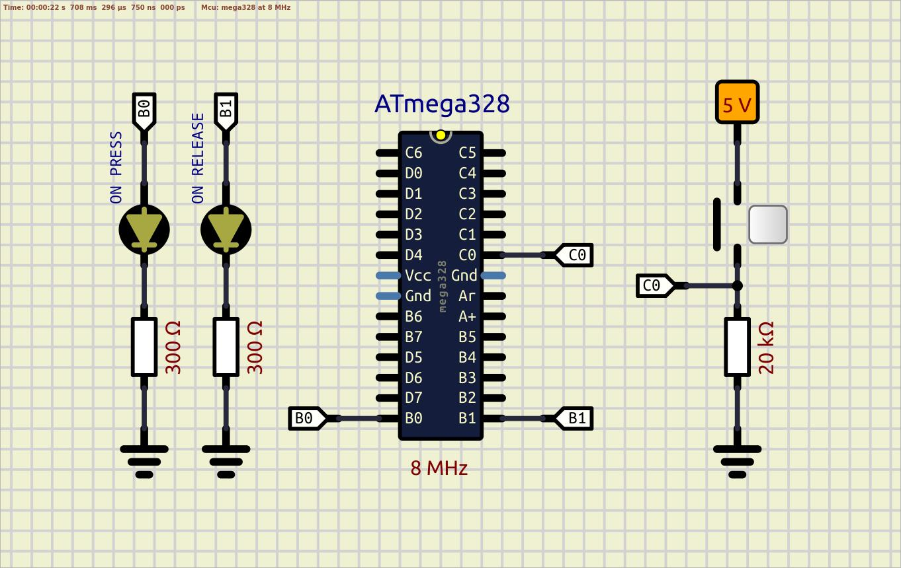
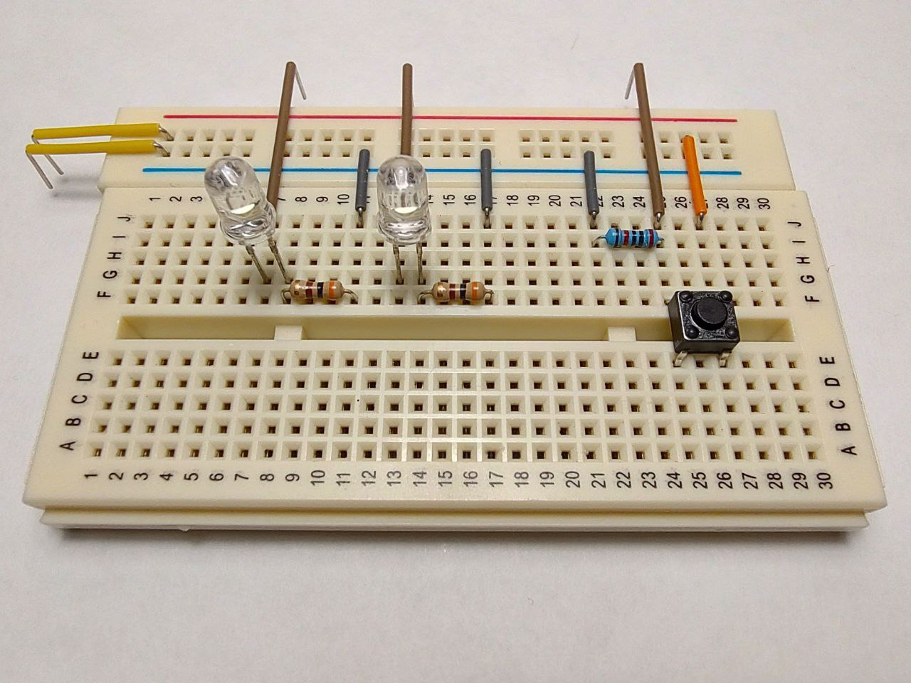

### Example 05 - EXTERNAL PULL-DOWN resistor is used, R = 20kΩ 

Scheme:  
  

Breadboard:  
  

**SIMULATION:** No simulation issues in SimulIDE  
**REALTIME:** The start is fine, several hits on the button are accompanied by a bounce, ignoring the pull-up resistor leads to the high-impedance state of a button pin, and LEDs start to blink randomly until button will be pushed  