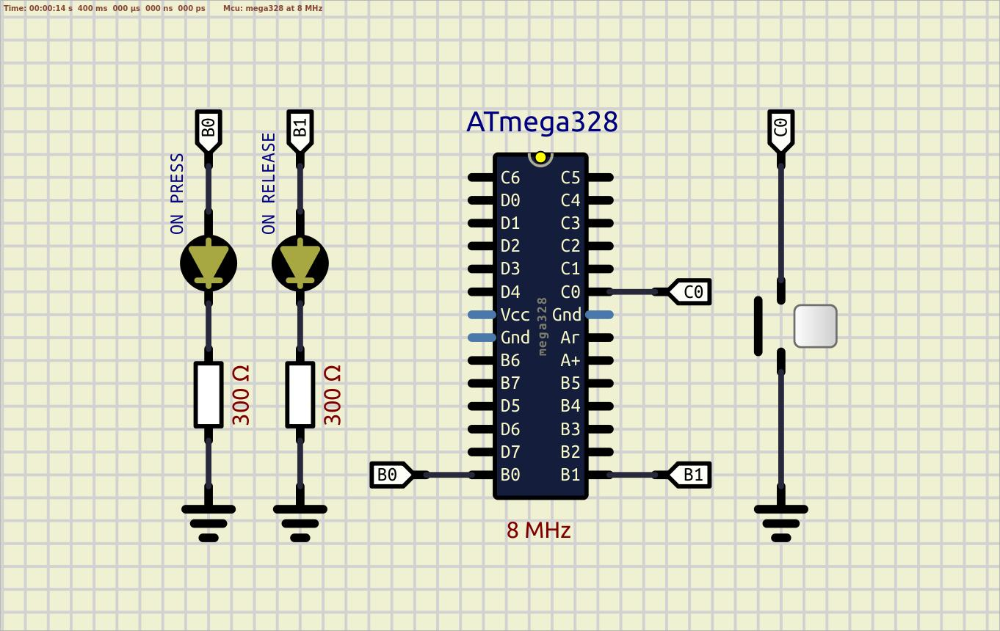
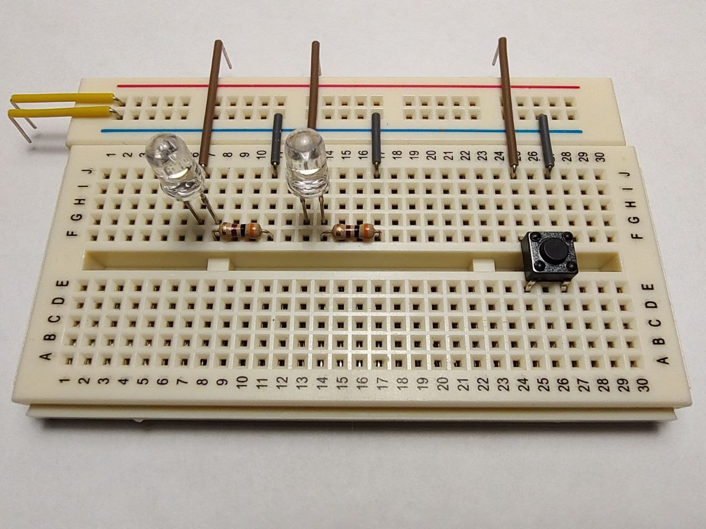

### Example 07 - Software debounce

The main idea is to increace a time between button pin state cheks. In the current example delay() is used for software debounce, but ideally we should use the button state machine, and hardware timer interrupts to make it non-blocking.

Scheme:  
  

Breadboard:  
  

**SIMULATION:** No simulation issues in SimulIDE  
**REALTIME:** The start is fine, several hits on the button aren't accompanied by a bounce  