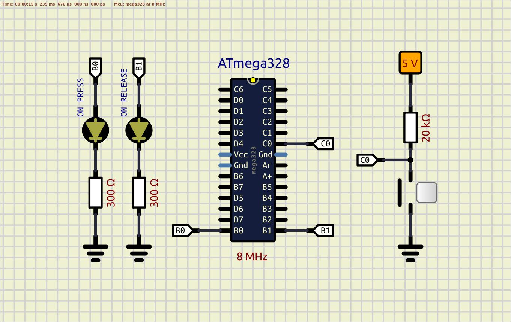

### Button

This solution contains several examples with buttons. According to the section 28.2 "DC Characteristics" of the datasheet the resistance of internal pull-up resistor is about [20; 50]kΩ.  

#### Example 01 - INTERNAL PULL-UP resistor is used  
  
  

*SIMULATION: No simulation issues in SimulIDE*  
*REALTIME: The start is fine. Several hits on the button are accompanied by a bounce*  

#### Example 02 - INTERNAL PULL-UP resistor is used, R = 2.2kΩ and C = 0.1µF is used for debouncing  
  
  

*SIMULATION: LEDs is turned on at the beginning of a simulation in SimulIDE*  
*REALTIME: The start is incorrect: LEDs are turned on at the beggining. RC solution for debounce is fine*  

FIX: the internal pull-up capacitor needs some time to become fully charged, so after internal pull-up resistor activation some delay is needed.  
$τ = RC;$  
$τ = 50kΩ * 0,1uF = 500000Ω * 0,0000001F = 0,005s = 5ms$  

#### Example 03 - EXTERNAL PULL-UP resistor is used, R = 20kΩ 
  
  

*SIMULATION: No simulation issues in SimulIDE*  
*REALTIME: The start is fine. Several hits on the button are accompanied by a bounce, ignoring the pull-up resistor leads to the high-impedance state of a button pin, and LEDs start to blink randomly*  

#### Example 04 - EXTERNAL PULL-UP resistor is used R = 20kΩ, R = 2.2kΩ and C = 0.1µF is used for debouncing  
  
  

*SIMULATION: LEDs is turned on at the beginning of a simulation in SimulIDE!*  
*REALTIME: The start is fine. RC solution for debounce is fine, ignoring the pull-up resistor leads to the high-impedance state of a button pin, and LEDs start to blink randomly*  