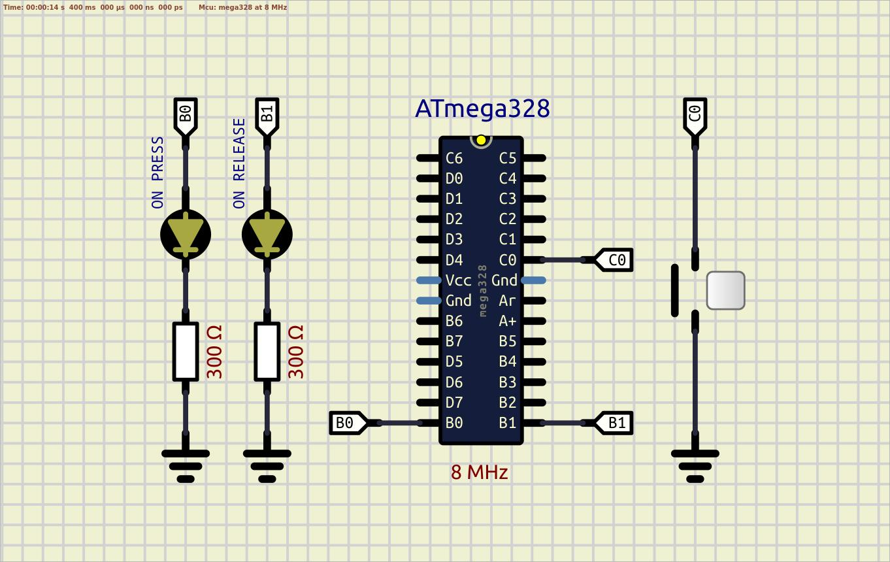

### Button

This solution contains several examples with buttons. According to the section 28.2 "DC Characteristics" of the datasheet the resistance of internal pull-up resistor is about [20; 50]kΩ.  

Example 01 - INTERNAL PULL-UP resistor is used  
  
  
*SIMULATION: No simulation issues in SimulIDE*  
*REALTIME: The start is fine. Several hits on the button are accompanied by a bounce*  
