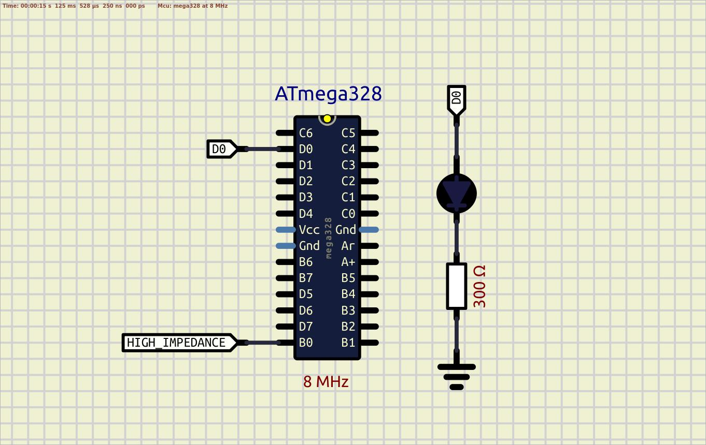

### EMI - Electromagnetic interferenc  

It is important to not keep MCU's pins in high-impedance state. Pulling up or pulling down helps to avoid unpredictable pin state or unwanted exposure of electromagnetic interference (also called radio-frequency interference - RFI).  

In the current example lets keep pin PB0 in Z-state (high impedance), and the output of PD0 will depend on the PB0 state.

Scheme:  
  

**SIMULATION:** Simulation shows nothing in SimulIDE  
**REALTIME:** System's behaviour is unpredictable!!!  

For extra investigation:  
- connect to the PB0 wires with different lengths and check the system  

See also:  
- [EMI](https://en.wikipedia.org/wiki/Electromagnetic_interference)  
- [C - goto](https://www.geeksforgeeks.org/goto-statement-in-c/)  
