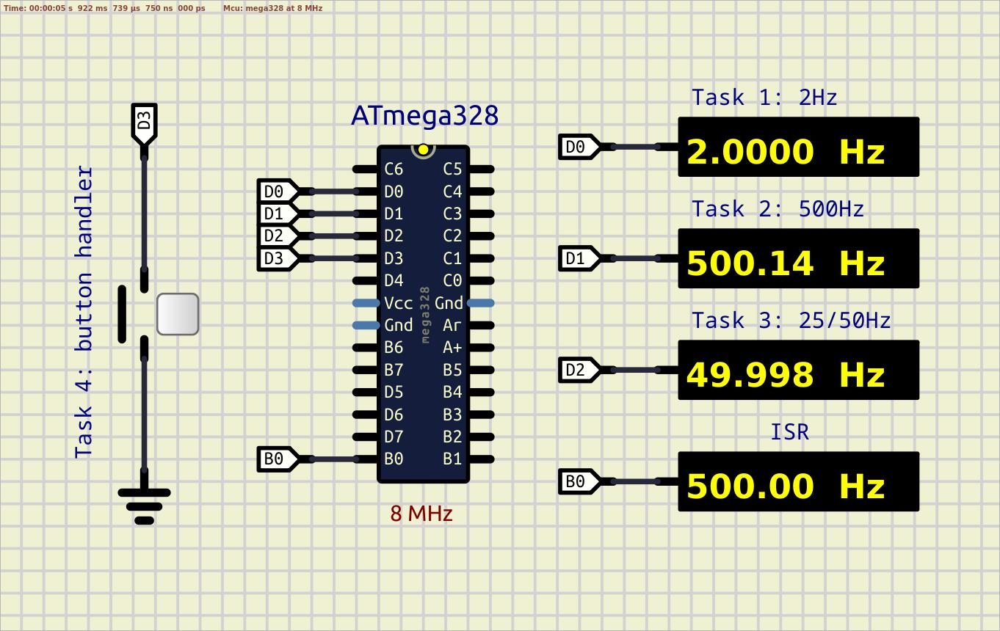

# Multitasking

Here is an example of the simplies "round robbin" scheduler using Timer/Counter 0. Slightly reworked comparing to the original example from ECE4760 for testing the hardware setup (see [Sched1GCC644.c](https://people.ece.cornell.edu/land/courses/ece4760/labs/s2012/Sched1GCC644.c "Sched1GCC644.c")).  

The main idea is to introduce a system time unit - sys tick. One ST equals to 1ms.  
Whith the crystal oscillator frequency of 8MHz 1 sys tick can perform 8000 one-cycle instructions.   
No serial communication, 4 tasks, and the button handling on push/release.  

- task 1 - 2Hz frequency beacon flasher;
- task 2 - 500Hz frequency beacon flasher;
- task 3 - 25/50Hz frequency beacon flasher;
- task 4 - button handler, enable or disable double speed flashing frequency in task 3.

Pin B0 is toggling right at the beginning of timer 0 compare and match ISR handler.
The main idea is that **we do not guarantee the exact execution moment** in time, but **we guarantie that each task will be performed with appropriate sys tick period**.  

For extra investigation:  
- with `make size` is it possible to check wether all timings fit in 1ms sys tick;  
- review an assembly listing of a source code and check wether it possible to switch sys tick to 0.1ms period or with 1MHz crystal quartz.    

Scheme:  
  

**SIMULATION:** Pins D1 and D2 show slightly different frequencies  
**REALTIME:** Good oscilloscope will show the same results as with simulation  

See also:  
- [ECE 4760: Laboratory 1 - General hardware Procedures](https://people.ece.cornell.edu/land/courses/ece4760/labs/s2012/lab1.html "ECE 4760: Laboratory 1 - General hardware Procedures]")  