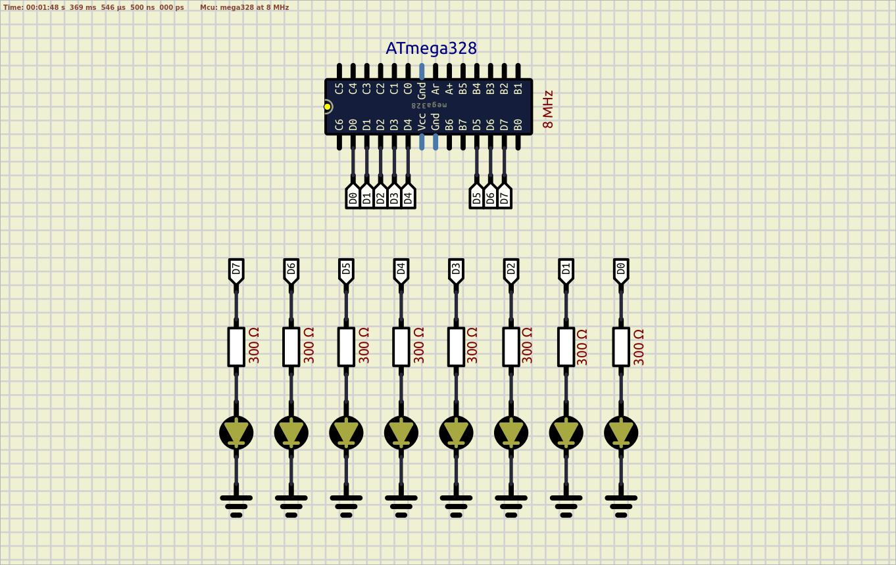

# GPIO driver

More lightweight version comparing to the version of Niklass.

Scheme:  
  

See also:  
- [#include guard](https://en.wikipedia.org/wiki/Include_guard)  
- [Niklas Nilsson - github](https://github.com/niklasab)  
- [Niklas Nilsson - YouTube channel](https://www.youtube.com/@artfulbytes)  
- [Niklas Nilsson - website](https://www.artfulbytes.com)  