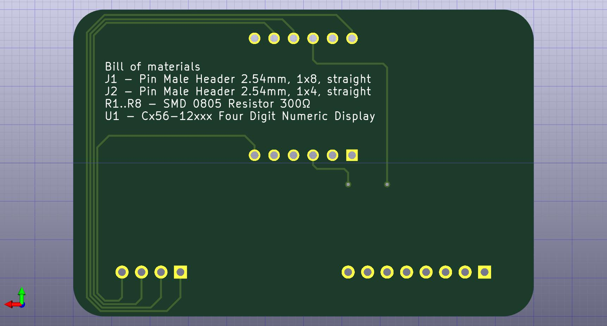

### Example 05 - Cx56-12xxx adapter

PCB top:  
  
  

PCB bottom:  
  
  

Device:  
  

### Useful links

- [How to generate Gerber and Drill files in KiCad 7](https://jlcpcb.com/help/article/362-how-to-generate-gerber-and-drill-files-in-kicad-7)  
- [KiCAD 7 PCB Layout in 5 steps](https://www.youtube.com/watch?v=3FGNw28xBr0)  