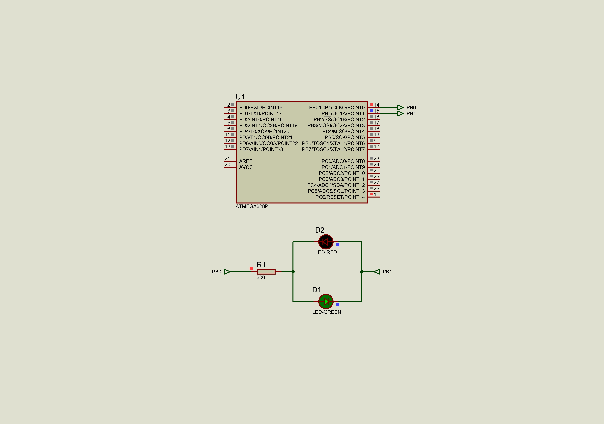
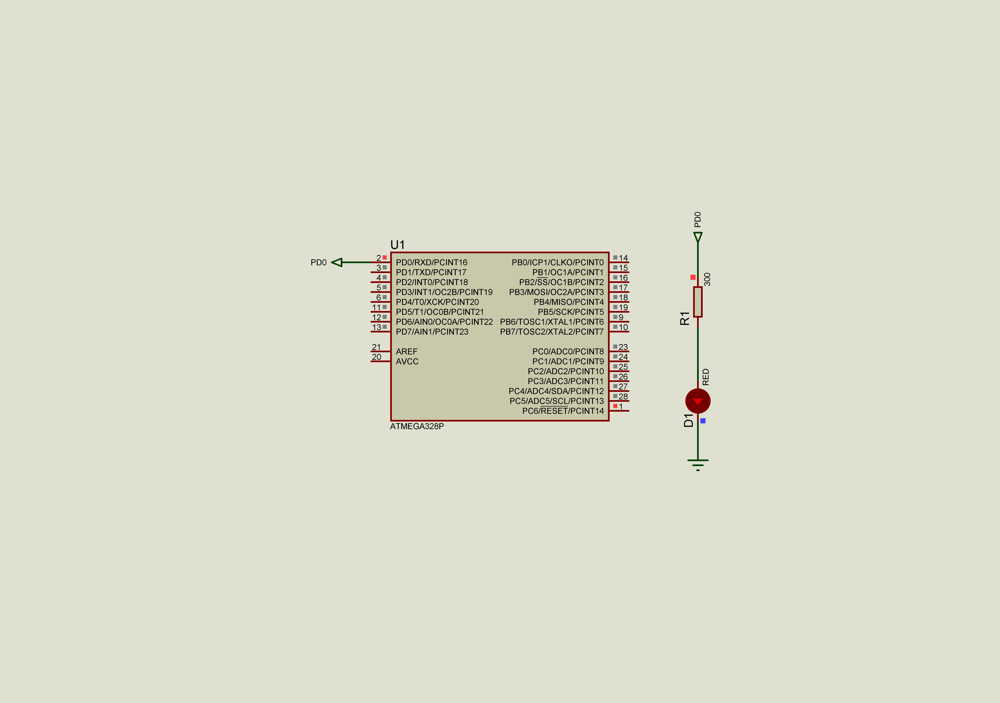

### Delay

There are two approach to form delays: using the *nop* instructions in loop (delay) and using the timer counters.  
The current solution contains two examples: the example of delay itself, and how the visual perception changes when the LED blinks with different frequencies.  
**It is important, we will not retrieve exact timings in these examples! Think why? How will change the real period depends on increasing or decreasing of a frequency?**  
Take a look at the paragraph 8.2.1 "Default Clock Source" of a "System Clock and Clock Options" section in datasheet.  
The device is shipped with internal RC oscillator at 8.0MHz and with the fuse CKDIV8 programmed, resulting in 1.0MHz
system clock.  

#### Example 1 - delay itself  

Below represented C code fragment with toggling LED pin WITHOUT delay  
 ```c
    while (1) 
    {
        //_delay_ms(2000);
        PORTB ^= _BV(PORTB0) | _BV(PORTB1);    // toggle pins
    }
 ```  
Appropriate assembly listing:  
```assembly
00000080 <main>:
  80:   83 e0           ldi     r24, 0x03       ; 3
  82:   84 b9           out     0x04, r24       ; 4
  84:   81 e0           ldi     r24, 0x01       ; 1
  86:   85 b9           out     0x05, r24       ; 5
  88:   93 e0           ldi     r25, 0x03       ; 3

  8a:   85 b1           in      r24, 0x05       ; 5
  8c:   89 27           eor     r24, r25
  8e:   85 b9           out     0x05, r24       ; 5
  90:   fc cf           rjmp    .-8             ; 0x8a <main+0xa>
```
Instructions description:  
80: load configuration value (0b00000011 or 0x03) to the register r24  
82: configure PIN0, PIN1 of DDRB as output  
84: load configuration value (0b00000001 or 0x01) to the register r24  
86: configure PIN0 of PORTB driven high (one), PIN1 of PORTB will be driven low (zero)  
88: load bitmask to the register r25 (for EXCLUCIVE OR operation)  
8a: write value of PORTB  to the register r24  
8c: apply exclusive OR between registers r24 and r25 (write result to the register r24)  
8e: write value of the register r24 to the PORTB  
90: jump to the instruction with address 0x8a  

It is possible highlight two parts of the firmware:  
instructions [80 ; 88] - initializing part  
instructions [8a ; 90] - main superloop

Below represented C code fragment with toggling LED pin WITH two seconds delay  
 ```c
    while (1) 
    {
        _delay_us(2000);
        PORTB ^= _BV(PORTB0) | _BV(PORTB1);   // toggle pins
    }
 ```
Appropriate assembly listing:  
 ```assembly
 00000080 <main>:
  80:   83 e0           ldi     r24, 0x03       ; 3
  82:   84 b9           out     0x04, r24       ; 4
  84:   81 e0           ldi     r24, 0x01       ; 1
  86:   85 b9           out     0x05, r24       ; 5
  88:   93 e0           ldi     r25, 0x03       ; 3

  8a:   2f e7           ldi     r18, 0x7F       ; 127
  8c:   3a e1           ldi     r19, 0x1A       ; 26
  8e:   86 e0           ldi     r24, 0x06       ; 6
  90:   21 50           subi    r18, 0x01       ; 1
  92:   30 40           sbci    r19, 0x00       ; 0
  94:   80 40           sbci    r24, 0x00       ; 0
  96:   e1 f7           brne    .-8             ; 0x90 <main+0x10>
  98:   00 c0           rjmp    .+0             ; 0x9a <main+0x1a>
  9a:   00 00           nop

  9c:   85 b1           in      r24, 0x05       ; 5
  9e:   89 27           eor     r24, r25
  a0:   85 b9           out     0x05, r24       ; 5
  a2:   f3 cf           rjmp    .-26            ; 0x8a <main+0xa>
 ```
 In this example we can highlight three parts of a programm:  
instructions [80 ; 88] - initializing part  
instructions [8a ; a2] - form main superloop  
where:  
instructions [8a ; 9a] - form delay before toggling a led  
instructions [9c ; a2] - toggle a LED pin itself  



#### Example 2 - visual perception

// TODO add description

1Hz - just a period of one second;  
24Hz - frame rate standard for 35 mm sound films;  
50Hz - AC frequency standart (use camera of a smartphone to see blinking);  
240Hz - display matrix refresh rate.  



#### Example 3 - visual perception refactoring using an extra header file

// TODO add description

See also:  
- [AVR Instruction Set Manual](http://ww1.microchip.com/downloads/en/devicedoc/atmel-0856-avr-instruction-set-manual.pdf)  
- [#include guard](https://en.wikipedia.org/wiki/Include_guard)  
