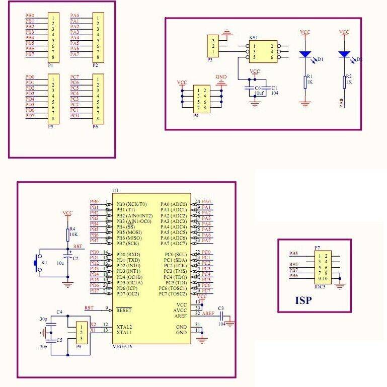

### ATmega644

#### The ATmega644 is a low-power CMOS 8-bit microcontroller based on the AVR enhanced RISC architecture

As a minimalistic system development board you can use a YL-34 (ATmega16 ATmega32 compatible).  

YL-34 circuitry:  
  

See also:  
- [ATmega644](https://www.microchip.com/en-us/product/atmega644#document-table)  
- [AVR Instruction Set Manual](https://ww1.microchip.com/downloads/en/devicedoc/atmel-0856-avr-instruction-set-manual.pdf)  
- [AVR® Fuse Calculator](https://www.engbedded.com/fusecalc/)  
