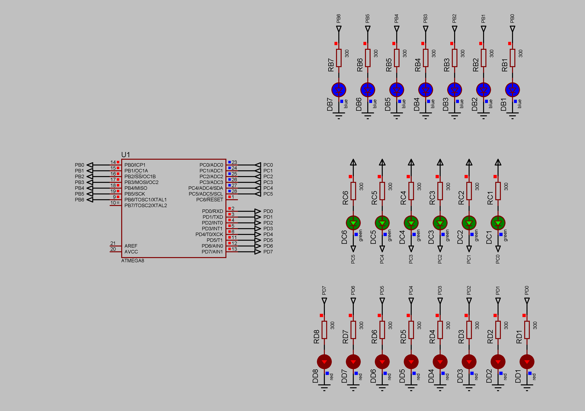

### LedOn project

A simple solution to light LEDs connected to the different ports pins.  
Current limiting resistors - 300 Ohm.  
Supply voltage - 5V.  
Port B and D pins configured driven high (one). LEDs are anode connected to the pins.  
Port C pins configured driven low (zero). LEDs are cathode connected to the pins.  

