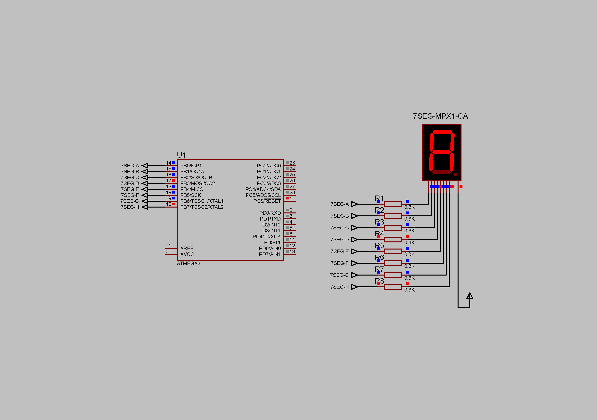

### Seven-segment display with common anode project

An example of data displayed to the seven-segment indicator (CA - common anode). Static lighting.  
Current limiting resistors - 300 Ohm.  
Supply voltage - 5V.  

