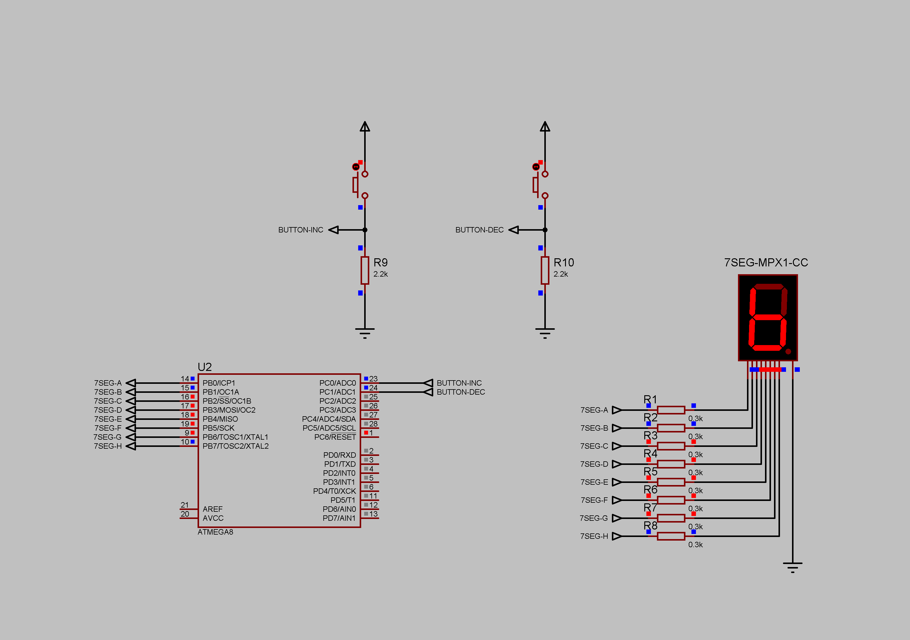

### Two-button counter project

Two buttuns conntected to the controller. The first one increments the accumulator value per one, the second one decrements the accumulator value per one. 
Stored values range for accumulator - from 0 to F (decimal 15). Accumulator value displayed to the seven-segment display. Static lighting.  
Current limiting resistors - 300 Ohm.  
Pull-down resistors - 2200 Ohm.  
Supply voltage - 5V.  

**NOTE: no debounce solutions.**  

