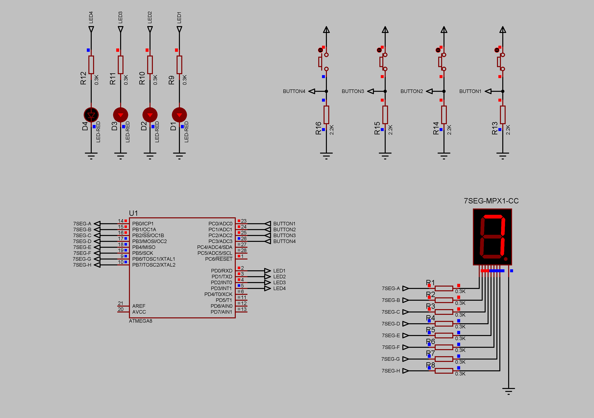

### Binary to hexadecimal converter project

Four buttons form a four-bit input value. Input value displays with LEDs in binary representation. Hexadecimal representation of input value displays to the seven-segment display.
Values range to display - from 0 to F (decimal 15).  
Current limiting resistors - 300 Ohm.  
Pull-down resistors - 2200 Ohm.  
Supply voltage - 5V.  

