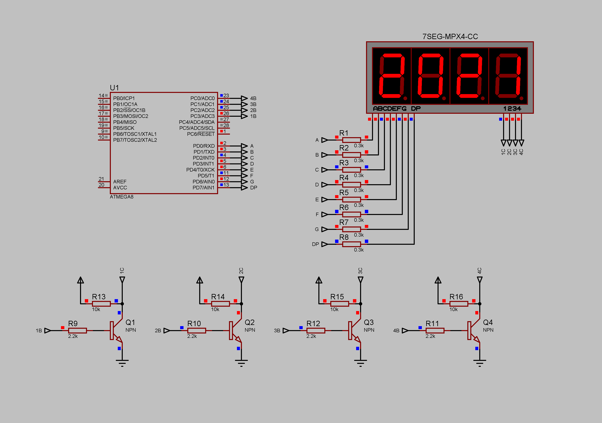

### Dynamic lighting with a transistor as a switch project

Example of dynamic lighting with four-digit seven-segment display with common cathode. The seven-segment display cathodes are controlled through NPN-transistors.  
Current limiting resistors - 300 Ohm.  
Pull-up resistors - 10 kOhm.  
Supply voltage - 5V.  

**NOTE: looks like a Proteus simulation issue: the scheme requires pull-up resistors (R13-R16) on the collector pin. The real scheme doesn't need them. Anyway, a good approach is not to leave pins in the high-impedance state.**  

