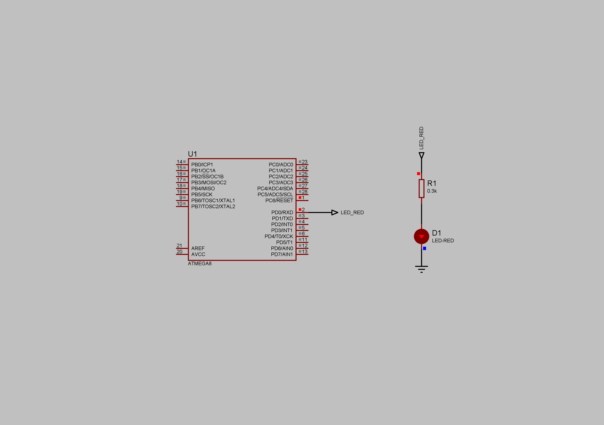

### Timer/Counter1 Overflow Interrupt

Timer/Counter1 is an 16-bit register (can hold values from 0 to 65535). The Prescaler value is set to 64. Internal RC Oscillator - 1MHz.  
Period of the overflow interruption events: (1/1000000)\*64\*65536 = 4.194304s.  
Current limiting resistor - 300 Ohm.  
Supply voltage - 5V.  

**NOTE: To check the period in Proteus use an initial period as 0.000044s (controller start-up time) then plus overflow period 4.194304s (depends on MCU frequency, Prescaler value, and register size) and so on.**  

