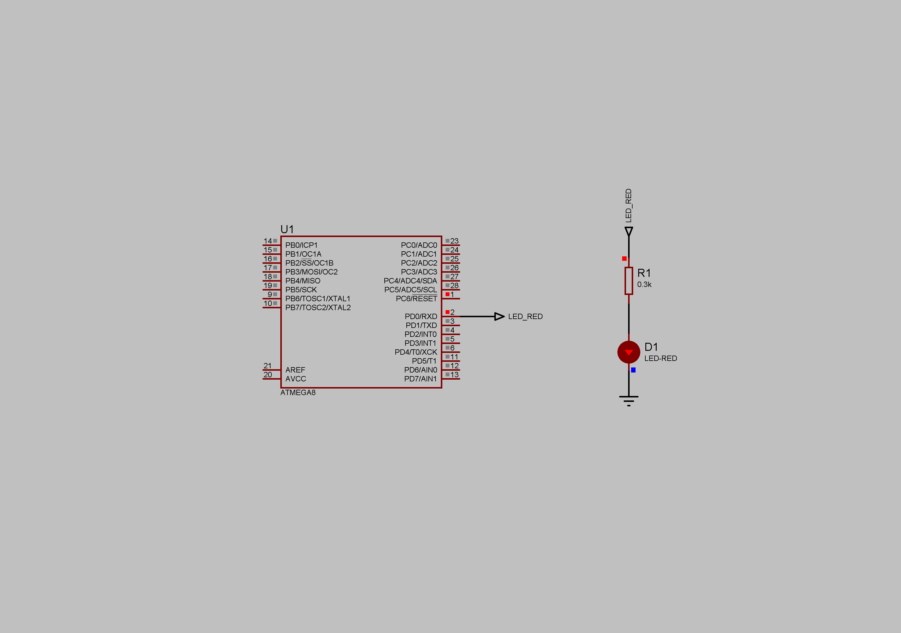

### Timer/Counter2 Overflow Interrupt

Timer/Counter2 is an 8-bit register (can hold values from 0 to 255). The Prescaler value is set to 1024. Internal RC Oscillator - 1MHz.  
Period of the overflow interruption events: (1/1000000)\*1024\*256 = 0.262144s.  
Current limiting resistor - 300 Ohm.  
Supply voltage - 5V.  

**NOTE: To check the period in Proteus use an initial period as 0.000044s (controller start-up time) then plus overflow period 0.262144s (depends on MCU frequency, Prescaler value, and register size) and so on.**  

