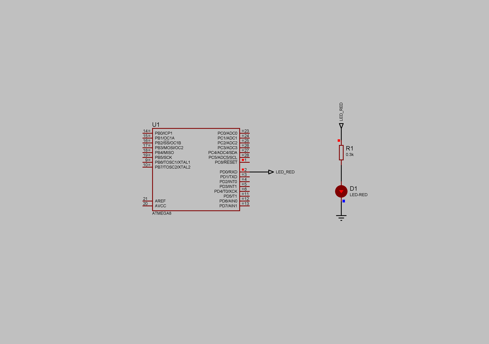

### Timer/Counter2 Compare Match Interrupt

Timer/Counter2 is an 8-bit register (can hold values from 0 to 255). The Prescaler value is set to 8. Internal RC Oscillator - 1MHz. Compare value - 249. Max iterations - 250.  
Clear Timer on Compare or CTC mode choosen.    
fOCnA = fclk/(2\*N\*(1 + OCRnA)) - see page 109 of datasheet.  
Total period of the led toggling: (1/1000000)\*8\*(1 + 249)\*250 = 0.500000s.  
Current limiting resistor - 300 Ohm.  
Supply voltage - 5V.  

**NOTE: Below shown simulation result in Proteus:**  

0.000000 - 0.502082		LED OFF  
0.502083 - 1.002083		LED ON  
1.002084 - 1.502082		LED OFF  
1.502083 - 2.002083		LED ON  
2.002084 - 2.502082		LED OFF  
2.502083 - 3.002083 	LED ON  
3.002084 - 3.502082		LED OFF  
3.502083 - 4.002083		LED ON  
4.002084 - ...			LED OFF  

	