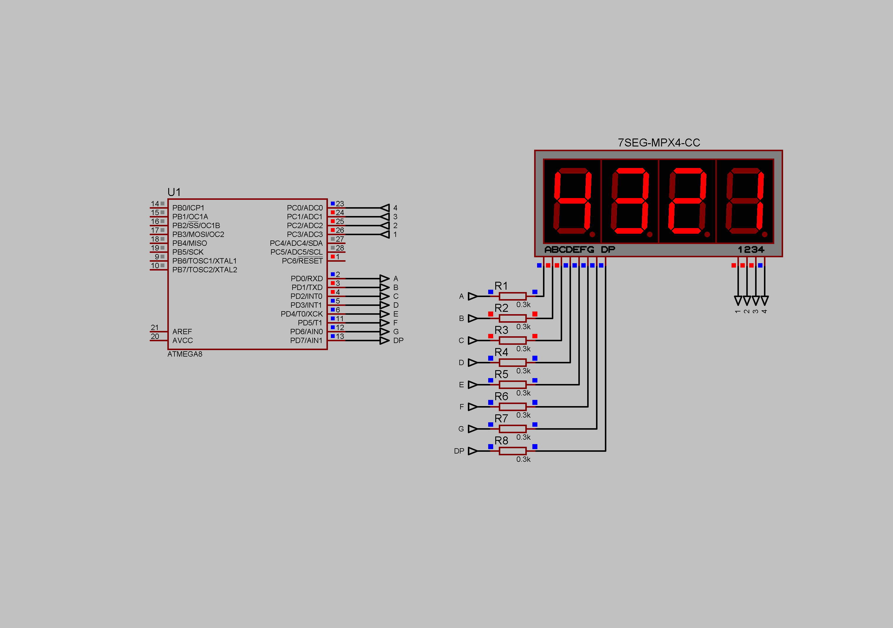

### Dynamic lighting with timer counter overflow interrupts

Example of proper implementation of dynamic lighting with timer counter overflow interrupts.  
Current limiting resistors - 300 Ohm.  
Supply voltage - 5V.  

